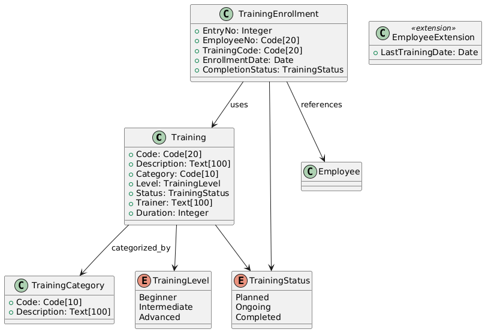

# Training Management Module for Business Central

## **Overview**
This module provides functionality to manage employee training within an organization using Microsoft Dynamics NAV / Business Central. It includes features for:
- Managing training courses.
- Managing training categories.
- Tracking employee enrollments.
- Monitoring training statuses (Planned, Ongoing, Completed).

## **Project Structure**

```
/TrainingManagementModule
├── .alpackages                        # AL language packages
├── .snapshots                         # Backup snapshots for development
├── .vscode                            # Visual Studio Code settings
├── Codeunits                          # Business logic implementation
├── Cues                               # Cue definitions for dashboards
├── Enums                              # Enum definitions for training levels and statuses
├── Headlines                          # Headlines for Role Centers
├── Layouts                            # Custom layouts for pages or reports
├── Pages                              # Page definitions for lists and cards
├── Reports                            # Report definitions (if any)
├── RoleCenters                        # Role Center definitions
├── Schema                             # Database schema and relationships
├── Tables                             # Table and table extensions
├── Translations                       # Localization files
├── app.json                           # Application configuration
├── README.md                          # Project documentation
└── HelloWorld.al                      # Placeholder or example AL file
```

---

## **Database Conception**

### **Entity-Relationship Diagram**

The database structure consists of three main tables and one extended table:

1. **Training Table**  
2. **Training Category Table**  
3. **Training Enrollment Table**  
4. **Employee Table (extended)**  

---

### **Tables and Relationships**

| Table                  | Description                                                                 |
|------------------------|-----------------------------------------------------------------------------|
| **Training**           | Stores training information (e.g., description, category, status, duration). |
| **Training Category**  | Stores categories for trainings (e.g., Technical, Soft Skills).            |
| **Training Enrollment**| Tracks which employees are enrolled in which training courses.             |
| **Employee**           | Extended table to include training-related fields (e.g., LastTrainingDate).|

---

### **Tables Schema**

1. **Training Table** (Primary Table)
   - **Fields**:
     | Field Name   | Data Type      | Description                          |
     |--------------|----------------|--------------------------------------|
     | Code         | Code[20]       | Unique training code (PK).           |
     | Description  | Text[100]      | Training description.                |
     | Category     | Code[10]       | References `Training Category`.      |
     | Level        | Enum           | Beginner, Intermediate, Advanced.    |
     | Status       | Enum           | Planned, Ongoing, Completed.         |
     | Trainer      | Text[100]      | Trainer conducting the training.     |
     | Duration     | Integer        | Duration of training (in hours).     |

   - **Primary Key**: Code  
   - **Relationships**:
     - `Category` → References `Training Category.Code`.

---

2. **Training Category Table**
   - **Fields**:
     | Field Name   | Data Type      | Description                          |
     |--------------|----------------|--------------------------------------|
     | Code         | Code[10]       | Unique category code (PK).           |
     | Description  | Text[100]      | Description of the category.         |

   - **Primary Key**: Code  

---

3. **Training Enrollment Table** (Many-to-Many Relationship)
   - **Fields**:
     | Field Name        | Data Type      | Description                          |
     |-------------------|----------------|--------------------------------------|
     | EntryNo           | Integer        | Auto-incremented primary key.        |
     | EmployeeNo        | Code[20]       | References `Employee.No`.            |
     | TrainingCode      | Code[20]       | References `Training.Code`.          |
     | EnrollmentDate    | Date           | Date of enrollment.                  |
     | CompletionStatus  | Enum           | Training completion status.          |

   - **Primary Key**: EntryNo  
   - **Relationships**:
     - `EmployeeNo` → References `Employee.No`.
     - `TrainingCode` → References `Training.Code`.

---

4. **Employee Table (Extended Table)**
   - **Fields Added**:
     | Field Name        | Data Type      | Description                          |
     |-------------------|----------------|--------------------------------------|
     | LastTrainingDate  | Date           | Date of the last training.           |

---

### **Class Diagram**




---

## **Installation Steps**

1. Open this project in **Visual Studio Code**.
2. Ensure the **AL Language** extension is installed.
3. Update the `launch.json` file with your sandbox environment.
4. Publish the project:
   - Press `Ctrl+Shift+B` to build.
   - Press `F5` or `Ctrl+F5` to deploy.

---

## **Usage**

- **Training List Page**:  
   Allows users to view and manage training records.

- **Training Enrollment Page**:  
   Allows users to enroll employees in training and track progress.

- **Training Category Page**:  
   Manage categories for organizing trainings.
